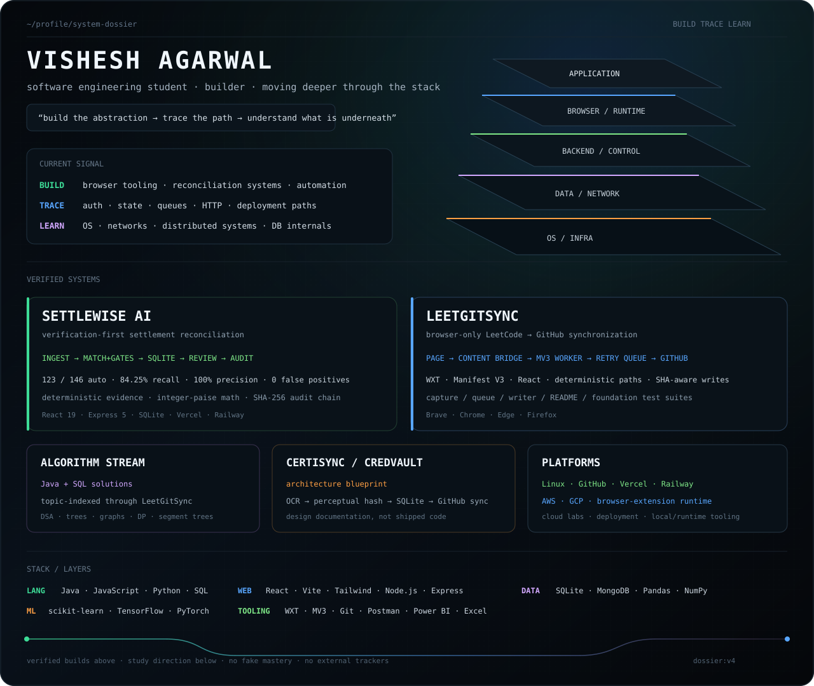

<p align="center">
  
</p>

## Selected systems

- [SettleWise AI](https://github.com/VisheshAgarwal0089/settlewise_ai) — reconciliation engine with deterministic matching, review flow, SQLite state, and tamper-evident audit history.
- [LeetGitSync](https://github.com/VisheshAgarwal0089/leetgitsync) — browser-only MV3 extension that captures accepted LeetCode submissions and writes them to GitHub.
- [leetcode_problems](https://github.com/VisheshAgarwal0089/leetcode_problems) — Java + SQL problem-solving stream indexed automatically by LeetGitSync.
- [CredVault / CertiSync](https://github.com/VisheshAgarwal0089/CredVault-AI-Powered-Certificate-Deduplicator-Repo-Streamliner) — architecture blueprint for local certificate deduplication and GitHub synchronization.

## Stack / platforms

```text
languages     Java · JavaScript · Python · SQL
web/runtime   React · Vite · Tailwind · Node.js · Express · WXT · MV3
data/ml       SQLite · MongoDB · Pandas · NumPy · scikit-learn · TensorFlow · PyTorch
platforms     Linux · GitHub · Vercel · Railway · AWS · GCP
tooling       Git · Postman · Power BI · Excel
```

## Current direction

```text
building      browser tooling · reconciliation systems · automation
studying      operating systems · computer networks · backend internals
deepening     distributed systems · database internals · protocols
```

## Links

[LinkedIn](https://www.linkedin.com/in/visheshagarwal0089/) · [LeetCode](https://leetcode.com/u/visheshaga0089/) · [Codolio](https://codolio.com/profile/vishesh0089)
