<div align="center">

<!-- Animated Header -->


<!-- Typing Animation -->
<a href="https://git.io/typing-svg">
  
</a>

<br/><br/>

<!-- Social Badges -->
[](https://linkedin.com/in/visheshagarwal0089)
[](mailto:aga.v.0089@gmail.com)
[](https://github.com/visheshagarwal0089)
[](https://github.com/visheshagarwal0089)

</div>

---

## 🧠 About Me

```yaml
👤  name       : Vishesh Agarwal
🌍  location   : India 🇮🇳
💼  role       : Full Stack Developer & ML Enthusiast
🔨  building   : Practical, real-world solutions
📚  learning   : Cleaner code, better patterns, emerging tools
🤝  open_to    : Meaningful collaborations & creative projects
⚡  fun_fact   : "I break things apart just to rebuild them better 🔧"
```

---

## 🚀 What I'm Working On

- 🏗️ Building full-stack apps with **React + Node.js**
- 🤖 Experimenting with **ML models** for real-world use cases
- 🌱 Sharpening skills in **system design** and **clean architecture**
- 🔍 Exploring **AI-powered tooling** and developer workflows

---

## 🐍 Watch My Contributions Get Eaten

<div align="center">
  <picture>
    <source media="(prefers-color-scheme: dark)" srcset="https://raw.githubusercontent.com/visheshagarwal0089/visheshagarwal0089/output/github-snake-dark.svg" />
    <source media="(prefers-color-scheme: light)" srcset="https://raw.githubusercontent.com/visheshagarwal0089/visheshagarwal0089/output/github-snake.svg" />
    
  </picture>
</div>

---

## 📊 GitHub Analytics

<div align="center">


</div>

<br/>

<div align="center">


</div>

---

## 🏆 GitHub Trophies

<div align="center">
  
</div>

---

## 💻 Tech Stack

### 🌐 Frontend
<div align="center">


</div>

### ⚙️ Backend & APIs
<div align="center">


</div>

### 🗄️ Databases & Data
<div align="center">


</div>

### 🤖 AI & Machine Learning
<div align="center">


</div>

### ☁️ Cloud, Infrastructure & Platforms
<div align="center">


</div>

### 🧩 Browser & Developer Tooling
<div align="center">


</div>

---

## 💬 Dev Quote of the Day

<div align="center">


</div>

---

## 🤝 Let's Connect & Build Something

<div align="center">

If you have an interesting idea, a project to collaborate on, or just want to say hi — my inbox is always open!

<br/>

[](https://linkedin.com/in/visheshagarwal0089)
[](mailto:aga.v.0089@gmail.com)

<br/>


</div>
